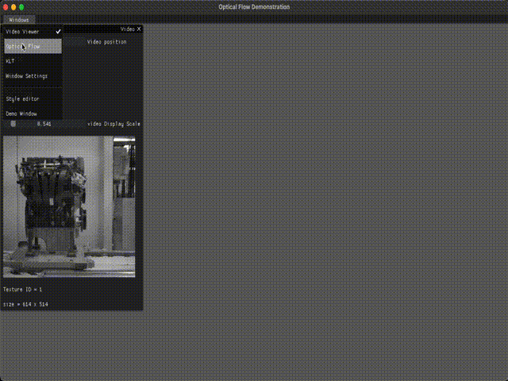

# project-river
Motion tracking of feature points and dense optical flow

## Description
This project takes video and calculates/displays the Farneback dense optical flow and KLT point tracking frame by frame using ImGui, GLFW, OpenCV and OpenGL. Input parameters for both algorithms can be updated with sliders in the UI and the videos can be saved using a button.

The UI template is based in the following code: [m516/CV-Sandbox](https://github.com/m516/CV-Sandbox/tree/master/src/09-OpenCV-Video-Template)

## Requirements
- Working C++ compiler (C++ 17 or greater)
- CMake (version >= 2.8)
- OpenCV (version >= 4.0.0)
- OpenGL (version >= 3.0.0)
- GLFW3

## Future Works
- Improve UI by allowing window resizing
- Add more functionality to dense optical flow visualization

## Example Results

<!-- |  | 
|:--:| 
| *Circles detected for blood image* |

|  | 
|:--:| 
| *Circles detected for cable image* |

|  | 
|:--:| 
| *Circles detected for cells image* |

|  | 
|:--:| 
| *Circles detected for circles image* | -->

## How to build
### Linux or MacOS
- Build project
  - create and navigate into a new directory in the cloned project directory: `mkdir build && cd build`
  - execute the following commands: `cmake ..` and `make`
- Run executable
  - to run the executable, execute the following: `./execute`
    - ex. command: `./execute`
    
<!-- ### Windows
- ***add the binary directory of OpenCV to System (or User) PATH variable***
  - ex. path: `C:\OpenCV-4.5.3\opencv\build\x64\vc15\bin`
- Build project
  - create and navigate into a new directory in the cloned project directory: `mkdir build && cd build`
  - execute the following command: `cmake -DOpenCV_DIR=<path to 'build' directory of OpenCV> ..`
    - ex. path: `C:\OpenCV-4.5.3\opencv\build`
  - open the build folder of the project and open the *.sln* Visual Studio file
  - change the startup project to *getThreshold* by right clicking on *getThreshold* in the Solution Explorer and selecting *Set as StartUp Project*
  - run code by clicking on the green arrow or pressing F5
- Run executable
  - open Command Prompt (or PowerShell) and navigate to the project build folder, then: `cd Debug`
  - in Debug, run the following command: `execute.exe <path to directory containing the images> <output file prefix> <minimum diameter> <maximum diameter> <threshold>`
    - ex. command: `getCircle.exe ../3_hough test 20 30 35` -->

# Libraries and Licenses
This work utilizes libraries whose licenses are as follows:
|                           Name |                                                         Installation instructions                                                         | License                                                                            | Github Repository                            |
| -----------------------------: | :---------------------------------------------------------------------------------------------------------------------------------------: | :--------------------------------------------------------------------------------- | :------------------------------------------- |
|  [OpenCV](https://opencv.org/) |     | [3-clause BSD License](https://opencv.org/license/)                                | [yes](https://github.com/opencv/opencv)      |
| CV-Sandbox |  | [MIT License](https://github.com/m516/CV-Sandbox/LICENSE) | [yes](https://github.com/m516/CV-Sandbox/tree/master/src/09-OpenCV-Video-Template) |
|  [GLFW](https://www.glfw.org/) |                        Included in project [(Official instructions)](https://github.com/glfw/glfw#compiling-glfw)                         | [zlib license](extern/glfw/LICENSE)                                                | [yes](https://github.com/glfw/glfw)          |
|                          ImGui |                                                   Included in project (static library)                                                    | [MIT License](extern/imgui/LICENSE)                                                | [yes](https://github.com/ocornut/imgui)      |

